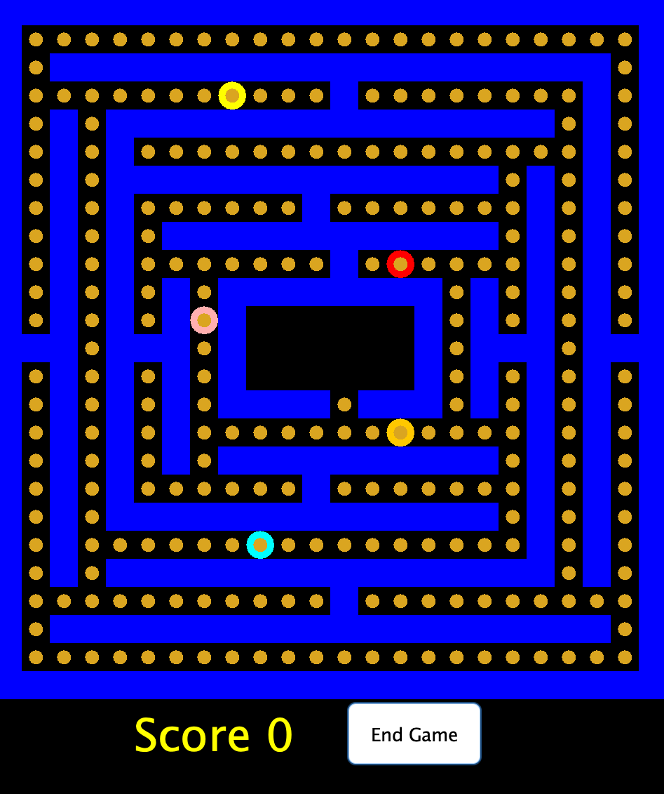

# Autonomous PacMan

By Mei-An Blatchford, Kieran Canter, Katherine Kemp, and Zayd Choudhary for CMSC388T Winter 2022



## How to run the game

To run the game, navigate to the folder that contains it. Then run the following commands in your command line. This will require that you have Java isntalled.

```bash
javac -cp "src/" src/*.java
java -cp "src/" StartMenu
```

## PacMan.java

PacMan.java contains the PacMan class, which has methods that allows PacMan to move around the map and eat cookies when possible.

### get_valid_moves()

This method uses Map's getLoc() function to check the nearby neighbors of the PacMan. PacMan can go up, down, left and right and PacMan cannot walk through walls or ghosts.

The test puts the PacMan on location (9,12) and calls get_valid_moves and asserts equal to the array of locations that are expected.

### move()

This method uses get_valid_moves() to check for possible places that PacMan could move to and then if there are possible moves, it uses the random number generator to choose one of those locations from the list and moves to it. It does this by updating the location of the ghost (myLoc), then it calls the move function on myMap so that this new location is updated on the game board.

The test provided creates a MainFrame and then adds PacMan to it. It then checks PacMan does move from this location, which should be true due to the location he is at. Then two ghosts are added in order to corner PacMan, and we check that he is unable to move.

### is_ghost_in_range()

### consume()

This method simply checks whether PacMan's current location contains a cookie or not. If it does, the JComponent return value of the Map.eatCookie method is returned. If it's not, null is returned.

The test written initializes a PacMan object (named pacman) that immediately ensures that pacman.consume() returns null. A cookie is placed on the map in the same location PacMan is, and pacman.consume() is run again to ensure it does not equal null this time.

## Ghost.java

Ghost.java contains the Ghost class, which has methods that allows ghosts to move around the map and attack PacMan when possible.

### get_valid_moves()

This method uses Map's getLoc() function to check the nearby neighbors of the specified Ghost. Ghosts can go up, down, left and right and PacMan cannot walk through walls, however they can walk through PacMan and other Ghosts.

The test puts a Ghost on location (9,12) and calls get_valid_moves and asserts equal to the array of locations that are expected.

### move()

This method uses get_valid_moves() to check for possible places that the ghost could move to and then if there are possible moves, it uses the random number generator to choose one of those locations from the list and moves to it. It does this by updating the location of the ghost (myLoc), then it calls the move function on myMap so that this new location is updated on the game board.

The test provided creates a MainFrame and then adds ghosts to it in two different places. Then it checks that the ghosts can move, which should be true because they are not blocked in based on where they are placed.

### is_pacman_in_range()

### attack()

The attack method for the Ghost class just checks if PacMan is close enough to attack, calling the is_pacman_in__range() method from the same Ghost class. The return value of this method is the same as the return value for is_pacman_in_range().

This method initializes a PacMan object (pacman) and a Ghost object (pinky). The ghost is placed one space away from PacMan and tested that pinky.attack() returns true. A new Ghost object (inky) is created and placed outside of attack range.

## Map.java

Map.java contains the Map class, which has methods that allows game board to be updated visually.

### move()

This method moves the specified type object to the new location given. First, we check if the new location is occupied by another type and if the spot is empty, the method changes the location of the specified object. Once the object is moved, the hashmaps for locations, component and field are updated with the new information.

In the test, I created a map with one PacMan and two ghosts and tested if I could move a Ghost to an empty spot and then to one where there was another Ghost.

### getLoc()

### attack()

This attack method takes in a String argument (Name) and immediately initializes a new Ghost object (ghost) with the name provided in the argument, the location of said name in the locations HashMap variable, and a map referencing the current Map object. An if statement confirms whether ghost.attack

### eatCookie()

This method uses the map's hash tables to get information about the JComponent and location for the parameter "name" as well as the Types at that location. Then, if a cookie is in one of those Types, it removes the cookie and increments cookies, which will later increment the score on the game board.

The test provided creates a MainFrame with PacMan and two ghosts. Then, PacMan is prompted to eat a cookie at his current location, which should succeed since the game just started and there are cookies at all valid locations. Then, he is prompted to eat a cookie again, which fails because it has already been eaten.
